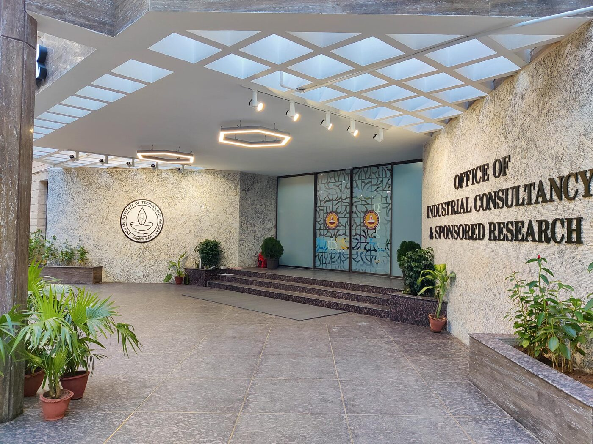

---
myst:
  html_meta:
    "description": "The SciPy India 2026 conference home page"
---

# SciPy India 2026

An international scientific computing and open source software conference

19th-20th December, 2026
<br>
Indian Institute of Technology Madras, Chennai 600036, Tamil Nadu, India

:::{div} sci-hero-buttons

```{button-link} https://scipy.in
:color: secondary
:outline:
:class: sci-new-tab

{octicon}`arrow-left` Go back to SciPy India's main website
```

```{button-link} https://scipy.in/past-editions
:color: secondary
:outline:
:class: sci-new-tab

{octicon}`history` Past editions
```

:::

% A countdown to the conference using FlipDown.
% This is currently set to 9 AM on 19th December 2026

```{raw} html
<div class="sci-countdown">
  <div id="flipdown" class="flipdown"></div>
</div>
<script>
  document.addEventListener("DOMContentLoaded", function () {
    if (!document.getElementById("flipdown") || typeof FlipDown === "undefined") {
      return;
    }
    var start = new Date("2026-12-19T09:00:00+05:30").getTime() / 1000;
    new FlipDown(start, "flipdown", { theme: "dark" }).start();
  });
</script>
```

## Welcome

We are elated to announce the **fourteenth edition** of the convening of scientific computing and research software enthusiasts in India, conveniently shortened and coined the "SciPy India 2026 conference".

::::{grid} 1 1 2 2
:gutter: 3

:::{grid-item-card} Call for proposals (CFP)
:link: cfp
:link-type: doc

Details coming soon! We expect to receive proposals for workshops and presentations on scientific computing and research software, and AI/ML applications with a scientific flavour.
:::

:::{grid-item-card} Registrations
:link: register
:link-type: doc

Opening soon!
:::

:::{grid-item-card} Programme
:link: programme
:link-type: doc

The SciPy India 2026 conference will be be hosted across two days. The first day will be a tutorials/workshops day, and the second day will be the main conference day. Our programme and all its sessions will be conducted entirely in English.

:::

:::{grid-item-card} Venue and travel
:link: venue
:link-type: doc

Visit this page for information on how to reach the venue, accommodation options, travel guidance, and visa requirements for international attendees.
:::

::::

Previous editions of the SciPy India conference ran from 2009 to 2021, at venues all across the country and consistently several times at the Indian Institute of Technology Bombay. We are pleased that 2026 is the first time the conference is being organised since 2021, and that it will be our first time in Chennai.

We expect to form the final [programme](programme) in October 2026. We will publish it, along with the session times, and announce the keynote presentations, selected talks, and workshops once it is finalised.

## Who is this conference for?

The SciPy India 2026 conference is for anyone who writes or depends on code to do scientific, computational, and data-driven work, including but not limited to:

- **Researchers and scientists** in academia, industry, and government laboratories;
- **Educators and faculty** involved in teaching and mentoring the practice of computational work and free and open source software (FOSS) in science and engineering;
- **Software developers** building and maintaining scientific libraries, tools, and infrastructure for research and education;
- **Research software engineers (RSEs)** supporting the development of scientific software, computing workflows, and reproducible research practices;
- **Engineers** reaching for the Python programming language and allied languages for modelling, simulating, and analysis of a wide range of mechanical, electrical, chemical, biological, and civil systems;
- **Data scientists and machine learning practitioners** building models and applying statistical and AI methods to extract insights from complex data;
- **HPC specialists and system administrators** building, running, and supporting distributed and cluster computing facilities in labs, universities, and industry;
- **Students** at any stage of training towards a career in scientific computing, data science and artificial intelligence, and research software;
- just about anyone with an enthusiasm for scientific computing, free and open source software (FOSS), and open science

We strive to make the conference accessible to all, and we welcome attendees from all backgrounds, disciplines, and levels of experience. We especially encourage participation from students, industry, early-career researchers, and those from underrepresented groups in STEAM (Science, Technology, Engineering, Arts, and Mathematics) fields. This includes women, non-binary individuals, and members of the LGBTQIA+ community, persons with disabilities, religious and ethnic minorities, members of Adivasi and tribal communities, and historically marginalised caste groups – including Scheduled Castes (SC), Scheduled Tribes (ST), and Other Backward Classes (OBC).

## Code of Conduct

We are committed to providing a safe and welcoming environment for all attendees, speakers, sponsors, and volunteers. We expect everyone to adhere to our [Code of Conduct](coc) and treat each other with respect and professionalism.

## Important dates

% TODO finalise these dates

```{eval-rst}
+----------------------------------------------------+-------------------+-------------------+
| What                                               | Opens             | Closes            |
+====================================================+===================+===================+
| Call for volunteers                                | To be announced   | To be announced   |
+----------------------------------------------------+-------------------+-------------------+
| Call for proposals                                 | To be announced   | To be announced   |
+----------------------------------------------------+-------------------+-------------------+
| Registration                                       | To be announced   | To be announced   |
+----------------------------------------------------+-------------------+-------------------+
| Early bird ticket prices end                       | To be announced                       |
+----------------------------------------------------+---------------------------------------+
| Programme announcement                             | To be announced                       |
+----------------------------------------------------+---------------------------------------+
| Workshops at the Department of Physics, IIT Madras | Saturday 19 December 2026             |
+----------------------------------------------------+---------------------------------------+
| Conference day at the IC&SR Building, IIT Madras   | Sunday 20 December 2026               |
+----------------------------------------------------+---------------------------------------+
| Talk recordings published                          | To be announced                       |
+----------------------------------------------------+-------------------+-------------------+
```

% Held-back rows, waiting on a decision:
%
% Once register.md has a refund policy:
% Cancelling or transferring a ticket | To be announced | To be announced
%
% If the guest houses or a hotel block booking come through:
% Accommodation block booking | To be announced | To be announced
%
% If we collect these separately from the registration form:
% Deadline for dietary requirements and T-shirt sizes | To be announced (spanning)
%
% If the evening gathering is confirmed:
% Conference social dinner | Saturday 19 December 2026 (spanning)

## Programme

### Workshops, 19th December (Saturday)

% The workshops will be hands-on sessions of roughly three hours on various software-oriented topics. Attendees are required to bring their laptops and complete the necessary prerequisites set by the workshop facilitators. There will be Wi-Fi available, but please have a mobile connection handy just in case. We will have room for a limited number of people in each workshop.

To be announced

### Conference, 20th December (Sunday)

% - Two keynotes
% - Talks of 30 minutes including questions (planning ongoing)
% - Five-minute Lightning talks/three-minute theses session (planning ongoing)
% - Poster session

To be announced

## Venue

The SciPy India 2026 conference will be held at the Indian Institute of Technology Madras, Chennai 600036, Tamil Nadu, India.

The workshops on 19th December 2026 will be held at the seminar halls of the Department of Physics. The conference on 20th December 2026 will be held at the T.T. Jagannathan and A.M.M. Arunachalam auditoriums at the Centre for Industrial Consultancy and Sponsored Research (IC&SR) building. Both buildings are at a distance of 400 metres from each other.

The campus is about 15 kilometres from the Chennai International Airport (MAA), 13 kilometres from the Chennai Central Railway Station, and 10 kilometres from the Chennai Egmore Railway Station.

Please refer to the [venue and travel page](venue) for detailed information on directions, notes on accommodation, and general travel guidance.

% The photo and the map sit in one row of two equal cells. Both cells are 4:3,
% which is the photo's own ratio and also Google's default 600x450 embed, so the
% photo fills its cell with no cropping and no stretching. See .sci-venue-media
% in \_static/custom.css. The photo carries the theme's dark-light class to opt
% out of the brightness filter the theme puts on images in dark mode.
%
% Source: https://ge.iitm.ac.in/oedai-2024/icsr.png. The /\_next/image?url=... form
% of that URL returns 400 without Next's w and q parameters, so it is not
% hotlinked. Re-encode with:
%
% magick icsr.png -resize 1400x -strip -interlace Plane \
% -sampling-factor 4:2:0 -quality 82 \_static/venue/icsr.jpg
%
% 1400px is twice the widest the image is ever displayed, which covers retina.
% Keep the result under 500 KB or pre-commit's check-added-large-files rejects it.

```{raw} html
<div class="sci-venue-media">
  
  <iframe
    src="https://www.google.com/maps/embed?pb=!1m18!1m12!1m3!1d3888.724988089748!2d80.22952707620642!3d12.991701387325474!2m3!1f0!2f0!3f0!3m2!1i1024!2i768!4f13.1!3m3!1m2!1s0x3a526780281bed21%3A0xd860742c9f32f3f4!2sCentre%20for%20Industrial%20Consultancy%20and%20Sponsored%20Research!5e0!3m2!1sen!2sin!4v1785406100996!5m2!1sen!2sin"
    width="600"
    height="450"
    title="Map of the IC&amp;SR Building at IIT Madras, Chennai"
    allowfullscreen=""
    loading="lazy"
    referrerpolicy="strict-origin-when-cross-origin">
  </iframe>
</div>
```

```{button-link} https://maps.app.goo.gl/ND5Bg5HP9Waayoc88
:color: primary
:outline:
:class: sci-new-tab

{octicon}`link-external` Open in Google Maps
```

## Call for proposals

We will soon be opening our call for proposals (CFP) for talks and workshops. Please keep an eye on this webpage and our social media for updates!

```{button-ref} cfp
:ref-type: doc
:color: primary
:outline:

Read more about our call for proposals
```

## Registration

To be announced. Tickets sales starting soon!

## Recordings

We plan to publish recordings of the conference day sessions on [our YouTube channel](https://www.youtube.com/@scipy-india) after the conference.

## Our partners, supporters, and sponsors

### Venue host

::::{grid} 1
:gutter: 3

:::{grid-item-card}
:text-align: center
:shadow: sm

```{image} _static/partner-logos/iitm.svg
:alt: Indian Institute of Technology Madras
:class: partner-logo sci-supporter-logo sci-logo-tall
:target: https://www.iitm.ac.in
```

Thank you to the [Indian Institute of Technology Madras](https://www.iitm.ac.in), Chennai 600036, Tamil Nadu, India for hosting us this year!
:::

::::

### Sponsors

To be announced. We will be opening a call for sponsors soon, and we will be looking for organisations, institutions, and corporate entities to support the conference. If you'd like to start the conversation, please get in touch with us at [info@scipy.in](mailto:info@scipy.in).

::::{grid} 1 3 3 3
:gutter: 3

:::{grid-item}

```{raw} html
<div class="sci-sponsor-slot">Your logo here!</div>
```

:::

:::{grid-item}

```{raw} html
<div class="sci-sponsor-slot">Your logo here!</div>
```

:::

:::{grid-item}

```{raw} html
<div class="sci-sponsor-slot">Your logo here!</div>
```

:::

::::

### Community partners

::::{grid} 1 1 2 2
:gutter: 3

:::{grid-item-card}
:text-align: center
:shadow: sm

```{image} _static/partner-logos/fossunited-dark.svg
:alt: FOSS United Foundation
:class: only-light partner-logo sci-supporter-logo
:target: https://fossunited.org
```

```{image} _static/partner-logos/fossunited-light.svg
:alt: FOSS United Foundation
:class: only-dark partner-logo sci-supporter-logo
:target: https://fossunited.org
```

[The FOSS United Foundation](https://fossunited.org), for providing their open source software platform to manage our call for proposals (CFP).
:::

:::{grid-item-card}
:text-align: center
:shadow: sm

```{image} _static/partner-logos/psf.svg
:alt: Python Software Foundation
:class: partner-logo sci-supporter-logo
:target: https://www.python.org/psf
```

SciPy India is an [official community partner](https://www.python.org/psf/community-partners/) of the Python Software Foundation.
:::

::::

### Institutional sponsors

::::{grid} 1
:gutter: 3

:::{grid-item-card}
:text-align: center
:shadow: sm

```{image} _static/partner-logos/afrost.svg
:alt: Afrost, the Association for Promotion of Free and Open Source Technologies
:class: partner-logo sci-supporter-logo
:target: https://afrost.org
```

[Association for Promotion of Free and Open Source Technologies](https://afrost.org) (CIN: U74999DL2017NPL319072)
:::

::::

## Updates

Our announcements will go out frequently on our [conference news page](news/index). There is an <a href="news/atom.xml">Atom feed</a> available.

If you would like to receive updates about the conference, please watch this space and follow us on our social media channels:

- Chat with us on our [our Zulip chat](https://zulip.scipy.in)
- [Bluesky](https://bsky.app/profile/scipy.in)
- [Mastodon](https://fosstodon.org/@scipyindia)
- [LinkedIn](https://www.linkedin.com/company/scipyindia)

- You may also reach out to us via email at [info@scipy.in](mailto:info@scipy.in)

Thank you for your interest in the SciPy India 2026 conference! We look forward to seeing you in December!

% Mostly just to make warnings go away:

```{toctree}
:hidden:
:maxdepth: 1

programme
Call for proposals <cfp>
register
Venue <venue>
jobs
Sponsor us <sponsor>
News <news/index>
faq
volunteer
Code of Conduct <coc>
team
```
