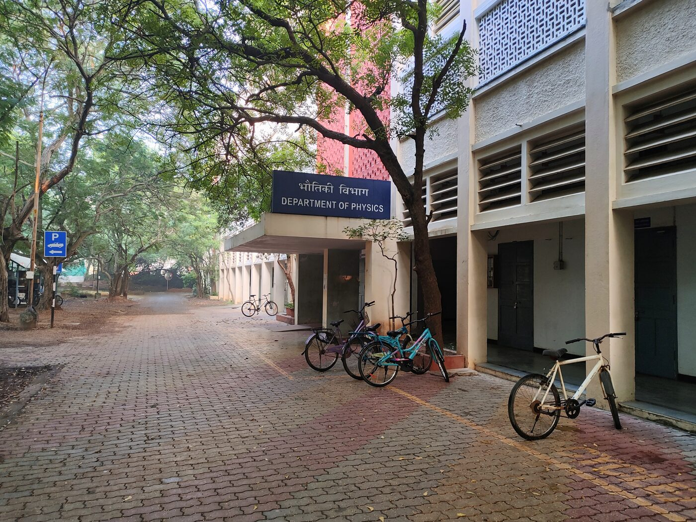

---
myst:
  html_meta:
    "description": "Venue and travel information for the SciPy India 2026 Conference"
---

# Venue and travel

Indian Institute of Technology Madras, Chennai 600036, Tamil Nadu, India

The two days will be held in different buildings on the campus, which are about 400 metres apart.

% TODO: Still need:
% - the entrance to use at each building
% - whether anyone is asked for ID at the gate
% - HSB is not signposted so we need standees or something to help people find it. Maybe a few volunteers to meet people at the gate and point them in the right direction...

% TODO: chasing the IC&SR accessible restroom stuff. HSB confirmed

## Workshops on Saturday, 19th December

The workshops will be held in the seminar halls of the [Department of Physics](https://maps.app.goo.gl/a6xVyb4dyofsjUcL7).

```{raw} html
<div class="sci-venue-media">
  
  <iframe
    src="https://www.google.com/maps/embed?pb=!1m18!1m12!1m3!1d2351.719169094031!2d80.23129513504304!3d12.989720525729387!2m3!1f0!2f0!3f0!3m2!1i1024!2i768!4f13.1!3m3!1m2!1s0x3a525d8002066921%3A0x72ac64139aeaf118!2sDepartment%20Of%20Physics%2C%20Indian%20Institute%20Of%20Technology%20Madras!5e0!3m2!1sen!2sin!4v1786197155204!5m2!1sen!2sin"
    width="600"
    height="450"
    title="Map of the Department of Physics at IIT Madras, Chennai"
    allowfullscreen=""
    loading="lazy"
    referrerpolicy="strict-origin-when-cross-origin">
  </iframe>
</div>
```

## Conference on Sunday, 20th December

The conference day will be held at the [IC&SR Building](https://maps.app.goo.gl/t8mo1UV9Rknef6qk9), in the T.T. Jagannathan and A.M.M. Arunachalam auditoriums.

```{raw} html
<div class="sci-venue-media">
  
  <iframe
    src="https://www.google.com/maps/embed?pb=!1m18!1m12!1m3!1d3888.724988089748!2d80.22952707620642!3d12.991701387325474!2m3!1f0!2f0!3f0!3m2!1i1024!2i768!4f13.1!3m3!1m2!1s0x3a526780281bed21%3A0xd860742c9f32f3f4!2sCentre%20for%20Industrial%20Consultancy%20and%20Sponsored%20Research!5e0!3m2!1sen!2sin!4v1785406100996!5m2!1sen!2sin"
    width="600"
    height="450"
    title="Map of the IC&amp;SR Building at IIT Madras, Chennai"
    allowfullscreen=""
    loading="lazy"
    referrerpolicy="strict-origin-when-cross-origin">
  </iframe>
</div>
```

## How to reach IIT Madras

:::{admonition} Please check your route before you travel
:class: Important

The directions below are provided on a best-effort basis and may not be completely accurate. Bus numbers, metro services, and journey times change, and we cannot vouch for the veracity of everything below. Please confirm your route with the operator or a maps application outside of this site before you travel and factor in extra time for delays, traffic, and other contingencies.

Parts of this are adapted from:

- [LLL 2026 at IIT Madras](https://ge.iitm.ac.in/lll-2026/how-to-reach)
- [ICOE 2025 at IIT Madras](https://ge.iitm.ac.in/icoe2025/contact.html)

:::

::::{grid} 1 1 2 2
:gutter: 4

:::{grid-item-card} From the Chennai International Airport (MAA)

**By taxi/car:** The quickest way to reach IIT Madras is by taxi or ride-sharing services such as Uber or Ola.

**Travel time:** Approximately 30-45 minutes depending on traffic.

**Distance:** Around 15 km.

**By bus:** Take a bus from the airport to Thiruvanmiyur or Adyar. Bus numbers that serve this route include 21G, 21L, and 21H.

From Thiruvanmiyur or Adyar, you can take an auto-rickshaw or a local bus to IIT Madras.

**By metro:** Take the Blue Line from the airport towards Wimco Nagar Depot and get off at Guindy.

From Guindy, take a bus (5C, 47A, or 49C) or an auto-rickshaw to IIT Madras.
:::

:::{grid-item-card} From the Chennai Central Railway Station

**By taxi/car:** Taxis and ride-sharing services such as Uber and Ola are readily available outside the station.

**Travel time:** Approximately 45-60 minutes depending on traffic.

**Distance:** Around 13 km.

**By bus:** Take a bus from Chennai Central to Adyar or Guindy. Bus numbers include 21G, 18B, and 19B.

From Adyar or Guindy, take an auto-rickshaw or a local bus to IIT Madras.

**By metro:** Take the Blue Line from Chennai Central (MGR Central) towards the airport and get off at Guindy.

From Guindy, take a bus (5C, 47A, or 49C) or an auto-rickshaw to IIT Madras.
:::

:::{grid-item-card} From the Chennai Egmore Railway Station

**By taxi/car:** Taxis and ride-sharing services such as Uber and Ola are available outside the station.

**Travel time:** Approximately 35-50 minutes depending on traffic.

**Distance:** Around 10 km.

**By bus:** Take a bus from Egmore to Adyar. Bus numbers include 23C, 23E, and 23A.

From Adyar, take an auto-rickshaw or a local bus to IIT Madras.

**By metro:** Take the Green Line from Egmore to Chennai Central (MGR Central). Change to the Blue Line towards the airport and get off at Guindy.

From Guindy, take a bus (5C, 47A, or 49C) or an auto-rickshaw to IIT Madras.
:::

:::{grid-item-card} Popular bus routes to IIT Madras

Bus numbers that frequently stop near IIT Madras include 5C, 21G, 21L, 23C, 47A, and 49C.

The stops closest to the campus are CLRI and Adyar Gate, on Sardar Patel Road by the main gate. Adyar, Guindy, and Thiruvanmiyur are the larger interchanges nearby.
:::

:::{grid-item-card} Arriving by intercity coach

Long-distance coaches arrive at the Chennai Mofussil Bus Terminus (CMBT) in Koyambedu.

**By metro:** Take the Green Line from CMBT to Chennai Central (MGR Central), change to the Blue Line towards the airport, and get off at Guindy.

**By taxi/car:** Simpler if you are carrying luggage!
:::

::::

## Getting onto campus

Please come in through the main gate. The campus is large, and it is about 2.4 km from the gate to Gajendra Circle at the centre of the campus.

An internal campus bus runs through this route and should take you from the main gate to Gajendra Circle, close to the IC&SR Building and roughly 400 metres from the Department of Physics. We recommend taking the bus over walking. While the walk is manageable if you would prefer, it takes long, so please plan accordingly and allow for extra time on the mornings of both days. Note that the bus fills up quickly and you may have to wait to board for the next one.

### Parking

Parking at the main gate is available and free. There is a limited number of spaces, but we expect there to be enough room in the third week of December if you are driving in. Please allow extra time to find a space, and consider carpooling if you are coming with colleagues or friends.

### Registration desk

On the conference day (20th December 2026), the registration desk will be in the foyer at the entrance to the IC&SR Building, where you can collect your conference badge.

On the workshop day (19th December 2026), the registration desk will be at the Department of Physics, where the workshops are held. The conference badge will also be available there for those attending the workshops.

Please wear your badge at all times during the conference and workshops.

### Wi-Fi

We expect guest Wi-Fi to be available to all attendees at the IC&SR Building and will be working towards setting it up. However, we would still recommend carrying a mobile connection as a fallback, particularly if you are presenting or otherwise need to stay connected for the duration of the conference.

### Refreshments and food nearby

There is a Café Coffee Day branch at a very short walk from the IC&SR Building, which is the nearest place to get a coffee or a quick bite between sessions.

:::{admonition} Note on campus access
:class: note

We are checking whether you will be asked for ID at the gate. We will publish both here once we have this information, along with a route map for the campus and the timings for the campus bus.
:::

## Accessibility information

The distance across the campus is the first thing to plan for. It is about 2.4 km from the main gate to Gajendra Circle, and we cannot guarantee you a seat on the internal bus. If neither the bus nor the walk is workable for you, please write to us at [info@scipy.in](mailto:info@scipy.in) and we will do our best to arrange a drop-off closer to the building with applicable arrangements.

This is what we have confirmed at each building so far:

### IC&SR Building, for the conference day on Sunday, 20th December 2026

- Step-free access: no, there is no ramp at the entrance.
- Lift: yes, although both auditoriums are on the ground floor, so you should not need it.
- Restrooms: segregated by gender. We have asked about an accessible restroom and will update this once we hear back.

### Department of Physics, for the workshops on Saturday, 19th December 2026

- Step-free access: yes, there is a ramp.
- Lift: yes.
- Restrooms: segregated by gender, and there is an accessible restroom.

We have not yet confirmed what is available by way of child care, and we will publish that here once we have this information.

If you have a specific accessibility requirement, please write to [info@scipy.in](mailto:info@scipy.in) ahead of time so that we can make arrangements for you.

## Accommodation

:::{admonition} Recommendations coming soon
:class: note

We will list options at several price points near campus, in Adyar, Guindy, and Velachery. The availability of guest house rooms on campus is limited. Please plan on staying off campus at this time and book early if you are coming from outside Chennai.
:::

% TODO: finalise Taramani and Bose-Einstein guest house availability for attendees

## Travelling from outside India as an international attendee

In case you are travelling to India as an international attendee, you may require a visa based on your nationality. The e-visa is available for many nationalities and can be applied for online. However, some nationalities may require a regular visa, which must be applied for at an Indian consulate or embassy in your country. Please check the [official Indian visa website](https://indianvisaonline.gov.in/visa/) for the most up-to-date information on visa requirements, application procedures, and applicable fees.

We will be able to provide a letter of invitation for visa applications, shall you require one, in light of your participation in the conference's activities as a spreaker, attendee, or volunteer. Please write to [info@scipy.in](mailto:info@scipy.in) with your name as it appears on your passport, your nationality, and all relevant details. The letter will be sent to you in PDF format by email. Please allow a few days for us to process your request.

As it stands, we are unable to provide guidance on visa applications, and we cannot guarantee that a visa will be issued. It is recommended that you apply for your visa well in advance of the conference, as processing times at embassies and consulates can vary and may take several weeks.

Please also check the latest travel advisories and entry requirements for India, as these may change due to ongoing public health considerations or other factors.

## Weather

Chennai experiences pleasant, humid weather in mid-December. We expect to have comfortable, warm days and mild evenings. We recommend preparing for high humidity and the occasional brief, passing shower. Please check the weather forecast closer to the conference date and pack accordingly, including light, breathable clothing, sun protection, and an umbrella or raincoat!
